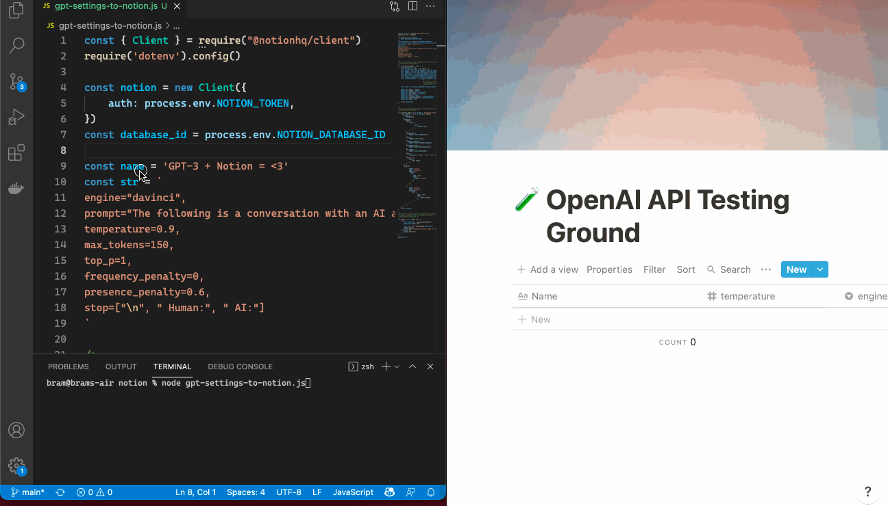
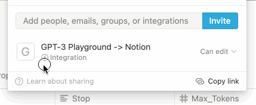
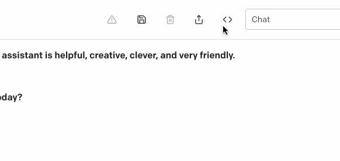

# GPT-3 Playground -> Notion DB

 

## Installation

1. [Duplicate this Database into your Notion](https://www.notion.so/68ff48517fb9460e98e0edd1081b3caf?v=139600a5e65b4db4b45d4a903141ba1f)
2. Create a Notion [Beta API account](https://developers.notion.com/)
3. Follow the instructions to create an Integration named `GPT-3 Playground -> Notion`
4. Add your Notion Keys and [Notion Database ID](https://developers.notion.com/docs/working-with-databases#adding-pages-to-a-database) to `.env`
5. Add the integration as an **editor** of the DB
 
6. Run `npm install`

## How To Use

1. In `gpt-settings-to-notion.js`, change `name` to what you want
2. Copy the variables from the Playground using the `Export Code` function and add them to `prompt`
 
3. Run `node gpt-settings-to-notion.js`